# ScreenRecAI-Desktop — Design Document

> A desktop screen recording application with AI-powered transcription and summarization, built on Electron + React + Python.

---

## Table of Contents

1. [High-Level Architecture](#1-high-level-architecture)
2. [Project Structure](#2-project-structure)
3. [Electron Three-Process Architecture](#3-electron-three-process-architecture)
4. [Main Process](#4-main-process)
5. [Preload Bridge](#5-preload-bridge)
6. [Renderer Process (UI)](#6-renderer-process-ui)
7. [IPC Communication Flow](#7-ipc-communication-flow)
8. [Recording Pipeline](#8-recording-pipeline)
9. [AI Transcript & Summary Pipeline](#9-ai-transcript--summary-pipeline)
10. [Binary Resolution Strategy](#10-binary-resolution-strategy)
11. [File Storage Organization](#11-file-storage-organization)
12. [Build & Packaging](#12-build--packaging)
13. [Type System](#13-type-system)
14. [Excalidraw Diagrams](#14-excalidraw-diagrams)

---

## 1. High-Level Architecture

ScreenRecAI-Desktop follows the standard **Electron three-process model**: a Main process (Node.js), a Preload bridge (isolated script), and a Renderer process (Chromium + React). The application captures screen video via Chromium's `desktopCapturer`, saves recordings as `.mp4` files, extracts audio with **FFmpeg**, transcribes it using **OpenAI Whisper** (local), and generates AI summaries via **Ollama** (local LLM). An optional **timed recording** mode allows users to set a duration; when the timer expires the recording automatically stops and triggers the full save + transcript + summary pipeline. A **canvas-based crop** mode lets users select a Region of Interest (ROI) on the live preview; when enabled, an offscreen `<canvas>` captures only the cropped area via `requestAnimationFrame` + `canvas.captureStream()`, producing a smaller output video.

```mermaid
graph TB
    subgraph "ScreenRecAI-Desktop"
        subgraph "Renderer Process<br/>(Chromium + React)"
            UI["React UI<br/>Components"]
            Hook["useRecording()<br/>Hook"]
            MR["MediaRecorder<br/>API"]
        end

        subgraph "Preload Bridge<br/>(Isolated Script)"
            CB["contextBridge<br/>exposeInMainWorld"]
            API["api.utils<br/>IPC Wrappers"]
        end

        subgraph "Main Process<br/>(Node.js)"
            IPC["IPC Handlers"]
            FU["file.utils"]
            TU["transcript.utils"]
            OU["ollama.utils"]
        end

        subgraph "External Services"
            PY["Python + Whisper<br/>(subprocess)"]
            FF["FFmpeg<br/>(audio extraction)"]
            OL["Ollama Server<br/>(localhost:11434)"]
        end
    end

    UI -->|"user actions"| Hook
    Hook -->|"getUserMedia"| MR
    MR -->|"Blob data"| Hook
    Hook -->|"window.electronAPI.*"| CB
    CB -->|"ipcRenderer.invoke"| API
    API -->|"IPC Channel"| IPC
    IPC --> FU
    IPC --> TU
    TU -->|"spawn"| PY
    PY -->|"subprocess"| FF
    TU -->|"parse JSON result"| IPC
    IPC --> OU
    OU -->|"HTTP POST"| OL

    style UI fill:#4FC3F7,color:#000
    style Hook fill:#4FC3F7,color:#000
    style MR fill:#4FC3F7,color:#000
    style CB fill:#FFB74D,color:#000
    style API fill:#FFB74D,color:#000
    style IPC fill:#81C784,color:#000
    style FU fill:#81C784,color:#000
    style TU fill:#81C784,color:#000
    style OU fill:#81C784,color:#000
    style PY fill:#CE93D8,color:#000
    style FF fill:#CE93D8,color:#000
    style OL fill:#CE93D8,color:#000
```

> 📎 See also: [architecture.excalidraw](architecture.excalidraw) for a visual layout diagram.

---

## 2. Project Structure

```text
ScreenRecAI-Desktop/
├── audio_extractor.py           # Python script for audio extraction + transcription
├── electron-builder.yml         # Build/packaging configuration
├── electron.vite.config.ts      # Vite config for 3-target Electron build
├── package.json                 # Node.js dependencies & scripts
├── requirements.txt             # Python dependencies
├── tailwind.config.js           # TailwindCSS configuration
├── src/
│   ├── main/                    # ── MAIN PROCESS (Node.js) ──
│   │   ├── index.ts             #   App entry point
│   │   ├── window.ts            #   BrowserWindow factory
│   │   ├── handlers/
│   │   │   └── ipc.handlers.ts  #   IPC message handlers
│   │   ├── types/
│   │   │   └── index.ts         #   Shared type definitions
│   │   └── utils/
│   │       ├── file.utils.ts    #   File system operations
│   │       ├── ollama.utils.ts  #   Ollama API client
│   │       └── transcript.utils.ts  # Python subprocess manager
│   │
│   ├── preload/                 # ── PRELOAD BRIDGE ──
│   │   ├── index.ts             #   Bridge entry point
│   │   ├── index.d.ts           #   Type declarations
│   │   ├── types/
│   │   │   └── index.ts         #   ElectronAPI interface
│   │   └── utils/
│   │       ├── api.utils.ts     #   IPC wrapper functions
│   │       └── bridge.utils.ts  #   contextBridge setup
│   │
│   └── renderer/                # ── RENDERER PROCESS (React) ──
│       ├── index.html           #   HTML shell
│       └── src/
│           ├── App.tsx          #   Root component
│           ├── main.tsx         #   React DOM entry
│           ├── components/      #   UI components
│           │   ├── CropOverlay/ #     Canvas crop selection overlay
│           │   ├── Header/
│           │   ├── icons/       #     SVG icon components (incl. Crop)
│           │   ├── RecordingControls/
│           │   ├── RecordingStatus/
│           │   ├── ScreenSelector/
│           │   ├── StatusMessages/
│           │   ├── StoragePath/
│           │   └── VideoPreview/ #     Live preview + recorded + crop controls
│           ├── hooks/           #   Custom React hooks
│           ├── styles/          #   CSS files
│           ├── types/           #   Frontend type definitions
│           └── utils/           #   UI & recording utilities
└── resources/                   # Static assets (icons, etc.)
```

---

## 3. Electron Three-Process Architecture

Electron enforces process separation for security. ScreenRecAI-Desktop uses this model with **context isolation** enabled.

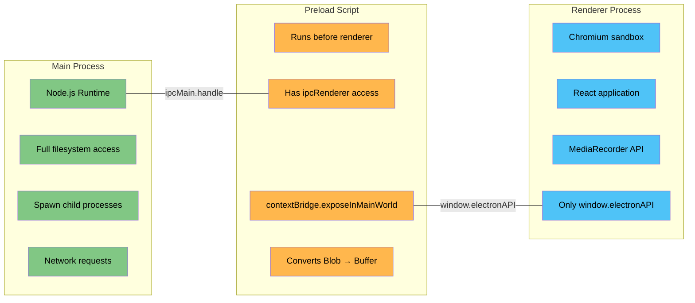

### Why Context Isolation Matters

Without context isolation, the renderer can directly access Node.js APIs — a major security risk. The preload script acts as a **controlled gate**, exposing only five functions to the renderer:

| Exposed Method | IPC Channel | Purpose |
| --- | --- | --- |
| `getDesktopSources()` | `get-desktop-sources` | List available screens and windows |
| `saveVideo(blob, filename)` | `save-video` | Save recording to disk |
| `processTranscript(blob, filename, type)` | `process-transcript` | Full AI pipeline |
| `getStoragePath()` | `get-storage-path` | Get current storage directory |
| `selectStoragePath()` | `select-storage-path` | Open folder picker to change storage directory |

---

## 4. Main Process

### 4.1 Entry Point (`src/main/index.ts`)

The entry point performs three actions on `app.whenReady()`:

1. **`initializeApp()`** — Sets Electron flags (e.g., `disable-gpu`) for compatibility
2. **`registerIpcHandlers()`** — Wires up all IPC channels
3. **`createWindow()`** — Opens the BrowserWindow

### 4.2 Window Creation (`src/main/window.ts`)

Creates a `BrowserWindow` with:
- **Size**: 1280×950 pixels
- **Context Isolation**: `true` (security)
- **Sandbox**: `false` (needed for preload Node.js access)
- **Permission Handler**: Auto-grants `media` permission requests (required for `desktopCapturer`)

```typescript
// Key window configuration
webPreferences: {
  preload: join(__dirname, '../preload/index.js'),
  sandbox: false,
  contextIsolation: true
}
```

In **dev mode**, the window loads `http://localhost:5173` (Vite dev server). In **production**, it loads the bundled HTML file.

### 4.3 IPC Handlers (`src/main/handlers/ipc.handlers.ts`)

Five handlers are registered on the main process (the three core handlers shown below plus `get-storage-path` and `select-storage-path` for configurable storage):

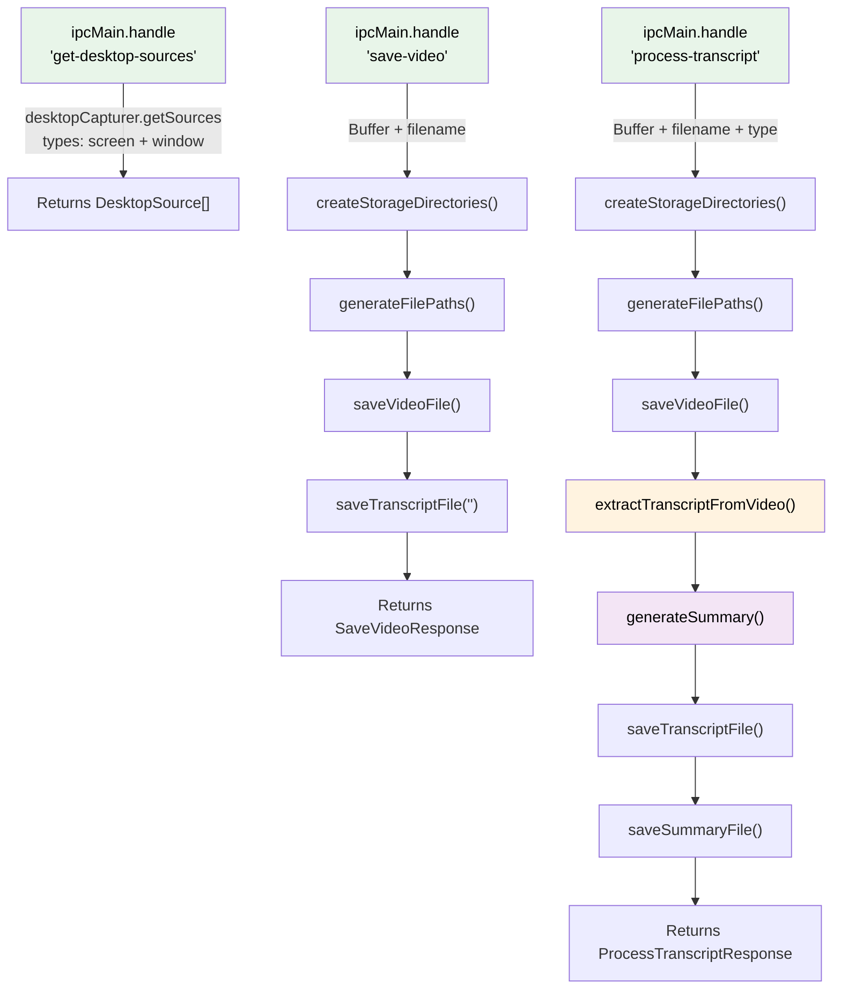

### 4.4 File Utilities (`src/main/utils/file.utils.ts`)

Handles all filesystem operations:

| Function | Purpose |
| --- | --- |
| `getStoragePath()` | Returns the configured storage base path (defaults to `Desktop/captured-videos`) |
| `setStoragePath(newPath)` | Persists a new storage base path to `storage-config.json` |
| `createStorageDirectories()` | Creates `{storagePath}/{YYYY-MM-DD}/` |
| `generateFilePaths(dateDir, filename)` | Returns `.mp4`, `.wav`, `.txt`, `-summary.txt` paths |
| `saveVideoFile(path, buffer)` | Writes video buffer to disk |
| `saveTranscriptFile(path, text)` | Writes transcript text |
| `saveSummaryFile(path, summary)` | Writes AI summary |
| `generateFallbackTranscript(videoPath)` | Returns placeholder text when Python unavailable |

### 4.5 Transcript Utilities (`src/main/utils/transcript.utils.ts`)

This is the **most complex module** in the project. It manages:
- Locating Python and FFmpeg binaries across different installation methods
- Spawning a Python subprocess to execute `audio_extractor.py`
- Passing an optional `audioOutputPath` for the extracted `.wav` file
- Parsing JSON output from the Python script
- Providing type-specific prompts for AI summarization

See [Section 10: Binary Resolution Strategy](#10-binary-resolution-strategy) for the detailed flowchart.

### 4.6 Ollama Utilities (`src/main/utils/ollama.utils.ts`)

Communicates with the locally-running Ollama server:

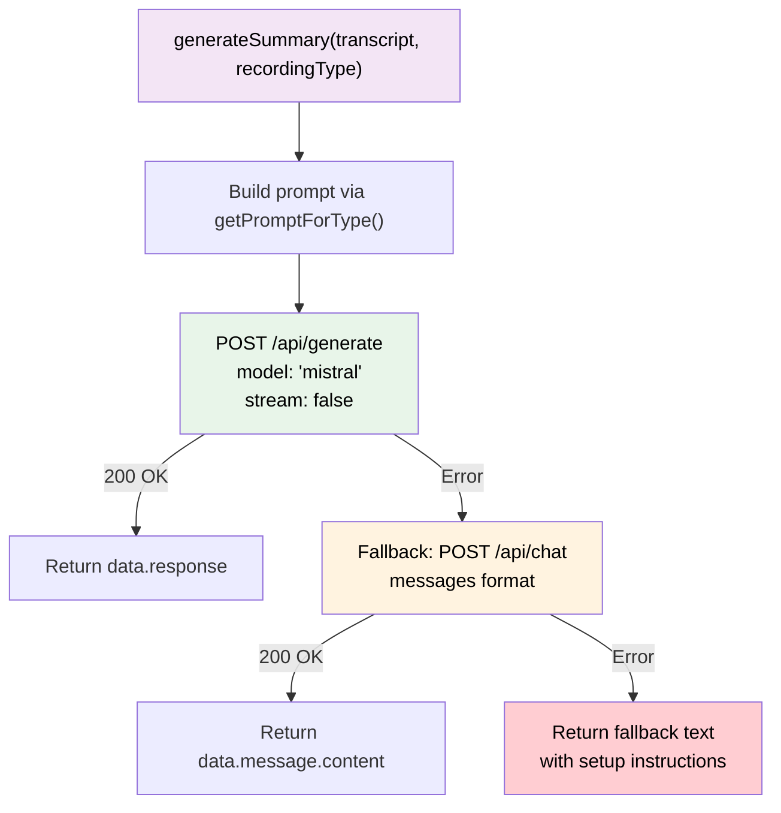

The dual-endpoint strategy (`/api/generate` → `/api/chat`) provides resilience against Ollama API version differences.

---

## 5. Preload Bridge

The preload bridge is the **security boundary** between the renderer (untrusted web content) and the main process (full OS access).

### 5.1 Bridge Setup (`src/preload/utils/bridge.utils.ts`)

```typescript
contextBridge.exposeInMainWorld('electronAPI', {
  getDesktopSources,   // () => Promise<DesktopSource[]>
  saveVideo,           // (blob, filename) => Promise<SaveVideoResponse>
  processTranscript,   // (blob, filename, type) => Promise<ProcessTranscriptResponse>
  getStoragePath,      // () => Promise<string>
  selectStoragePath    // () => Promise<string | null>
} as ElectronAPI)
```

### 5.2 API Utilities (`src/preload/utils/api.utils.ts`)

Each function wraps an `ipcRenderer.invoke()` call. The critical detail is **Blob-to-Buffer conversion**:

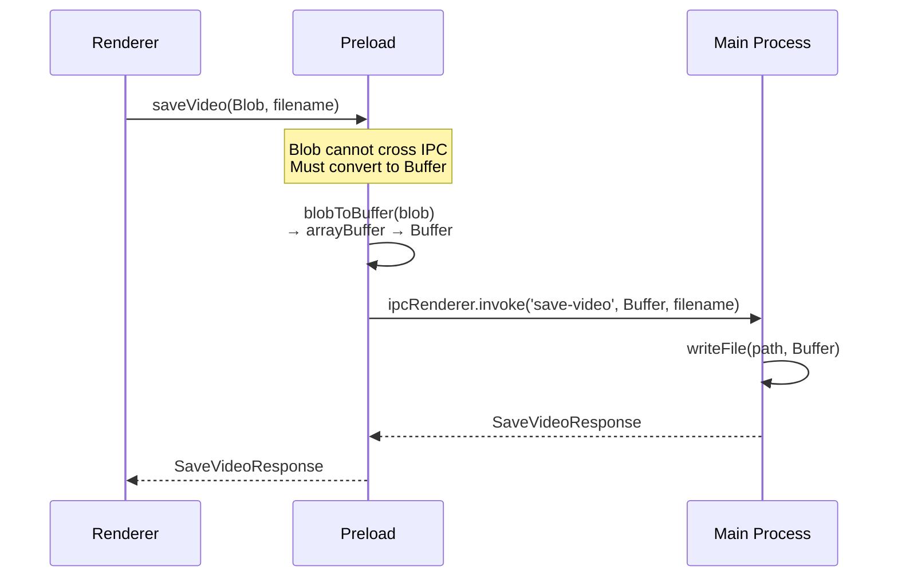

> **Why Blob → Buffer?** Electron's IPC uses structured cloning, which supports `ArrayBuffer` and `Buffer` but not `Blob` (a DOM API). The preload layer must serialize the Blob into a `Buffer` before sending it to the main process.

---

## 6. Renderer Process (UI)

### 6.1 Component Hierarchy

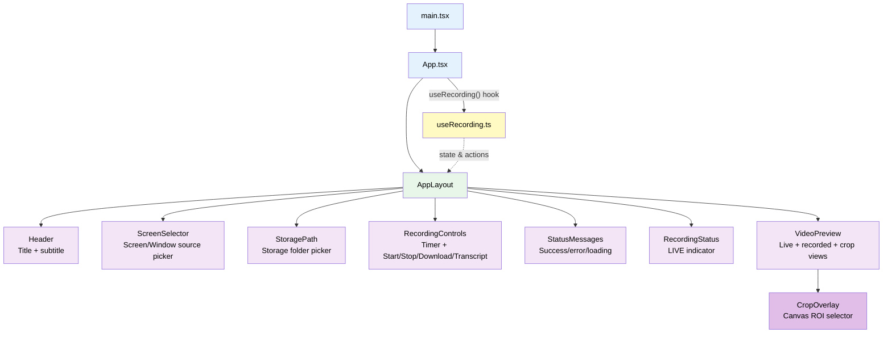

### 6.2 Component Details

| Component | File | Responsibility |
| --- | --- | --- |
| **App** | `App.tsx` | Root component; calls `useRecording()` hook, passes all state and callbacks to `AppLayout` |
| **AppLayout** | `AppLayout.tsx` | Pure layout component; composes all child components in a grid |
| **Header** | `Header/index.tsx` | Static title ("ScreenRec AI") and subtitle |
| **ScreenSelector** | `ScreenSelector/index.tsx` | Source picker listing available screens and windows from `desktopCapturer`, radio selection with screen/window type indicators, refresh button |
| **RecordingControls** | `RecordingControls/index.tsx` | Recording type selector (VIDEO / GOOGLE_MEET / LESSON), timer duration input (0–480 minutes), countdown display during timed recording, action buttons (Start, Stop, Download, Extract Transcript) with loading states |
| **StoragePath** | `StoragePath/index.tsx` | Displays the current storage directory path with a "Change" button that opens a native folder picker via `selectStoragePath()` IPC |
| **StatusMessages** | `StatusMessages/index.tsx` | Renders success (✅), error (❌), and loading (🔄) messages with icons |
| **RecordingStatus** | `RecordingStatus/index.tsx` | Conditional red "LIVE" badge visible during active recording |
| **VideoPreview** | `VideoPreview/index.tsx` | Two-panel layout: live `<video>` preview (stream) and recorded `<video>` playback (blob URL). Hosts crop toggle/clear buttons and renders the `CropOverlay` on the live preview panel. Auto-starts a preview stream when crop mode is activated. |
| **CropOverlay** | `CropOverlay/index.tsx` | Canvas-based overlay rendered on top of the live preview `<video>`. Handles mouse drag to draw a crop rectangle, converts pixel coordinates to normalized (0–1) video coordinates, renders a semi-transparent mask outside the selection with a dashed border and corner handles, and displays a pixel-dimension label. |

### 6.3 The `useRecording` Hook — Core State Machine

The `useRecording` hook is the **brain of the renderer process**. It manages the entire recording lifecycle, media streams, and IPC communication.

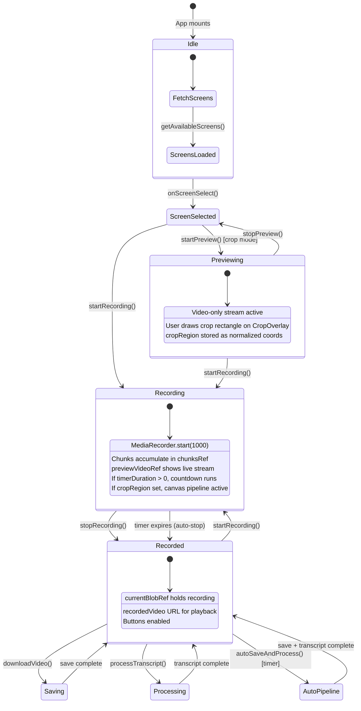

**Key state variables:**
- `stream` — Live `MediaStream` from `getUserMedia`
- `isRecording` — Whether MediaRecorder is active
- `isPreviewing` — Whether preview-only stream is active (for crop selection)
- `recordedVideo` — Object URL for playback
- `currentBlobRef` / `audioBlobRef` — Recording data (Blob refs)
- `chunksRef` — Accumulated `MediaRecorder` chunks
- `timerDuration` — User-configured recording length in minutes (0 = unlimited)
- `timeRemaining` — Seconds left in countdown (`null` when no timer active)
- `timerIntervalRef` — Ref holding the `setInterval` ID for the countdown
- `autoStopPendingRef` — Flag that signals `onstop` handler to trigger `autoSaveAndProcess()`
- `cropRegion` — Normalized `{x, y, width, height}` (0–1) defining the cropped area, or `null`
- `cropEnabled` — Whether the user is in crop-drawing mode
- `cropRegionRef` — Mutable ref mirroring `cropRegion` for the `requestAnimationFrame` loop
- `cropVideoRef` — Hidden `<video>` element used as the canvas source during cropped recording
- `animFrameRef` — `requestAnimationFrame` ID for the canvas draw loop

**Key actions:**
- `startPreview()` — Gets a video-only `MediaStream` for the selected screen. Used to show the live preview so the user can draw a crop rectangle before recording starts.
- `stopPreview()` — Stops the preview-only stream and resets `isPreviewing`.
- `startRecording()` — Gets a full media stream (audio + video) with `chromeMediaSource: 'desktop'`, creates `MediaRecorder`, collects chunks at 1-second intervals. **If `cropEnabled` and `cropRegion` are set**, creates an offscreen `<canvas>` sized to the crop dimensions, pipes frames via `requestAnimationFrame` + `drawImage()`, and records from `canvas.captureStream(30)` combined with the original audio tracks. If `timerDuration > 0`, starts a per-second countdown interval that auto-stops recording when it reaches zero.
- `stopRecording()` — Stops MediaRecorder and all tracks, clears any active timer, cleans up the crop pipeline (`cancelAnimationFrame`, hidden video element), creates final Blob, generates object URL
- `downloadVideo()` — Converts Blob → sends via `window.electronAPI.saveVideo()`
- `processTranscript()` — Converts Blob → sends via `window.electronAPI.processTranscript()` → displays transcript + summary
- `autoSaveAndProcess(blob)` — Triggered when the timer expires. Automatically saves the video via `saveVideo()` and then processes the transcript + summary via `processTranscript()` in sequence, updating status messages throughout.

### 6.4 Utility Modules

| Module | Key Functions | Purpose |
| --- | --- | --- |
| `recording.utils.ts` | `getVideoMimeType()`, `generateFilename()`, `generateTranscriptFilename()`, `getRecordingTypeIcon()`, `getRecordingTypeLabel()` | Detects MP4/AVC1 codec support (falls back to VP9 WebM), generates timestamped filenames, provides recording type icons and labels |
| `ui.utils.ts` | `getMessageType()`, `getButtonClasses()` | Maps emoji prefixes (✅❌🔄) to CSS classes |
| `video.utils.ts` | `downloadBlob()` | Creates temporary `<a>` element for file download |

---

## 7. IPC Communication Flow

This diagram shows the complete message flow for the three core IPC channels. Two additional channels (`get-storage-path` and `select-storage-path`) handle storage directory configuration.

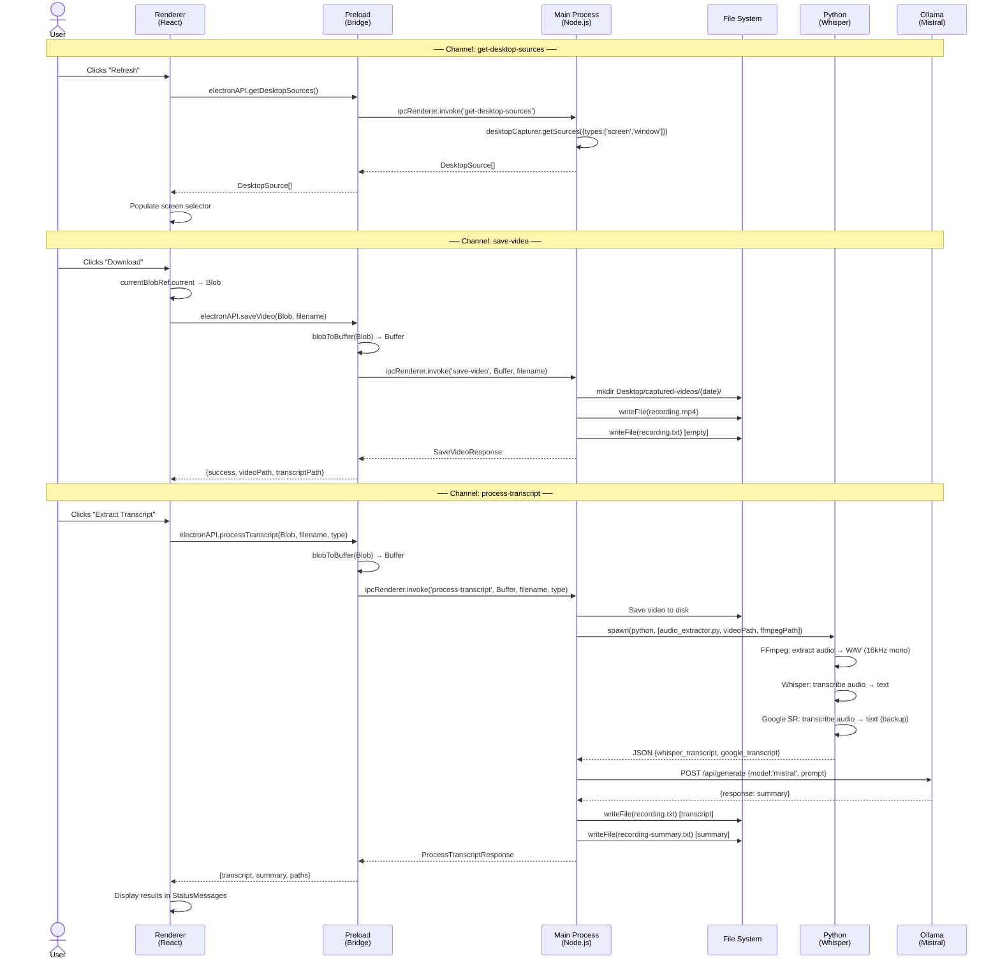

---

## 8. Recording Pipeline

The recording pipeline captures screen content using Chromium's built-in media APIs. An optional **canvas-based crop** path intercepts the stream before it reaches `MediaRecorder`.

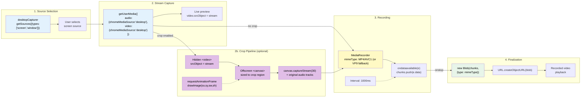

### Canvas-Based Crop Pipeline

When the user selects a crop region before recording:

1. The full desktop stream is piped into a hidden `<video>` element
2. An offscreen `<canvas>` is sized to the crop dimensions (pixels)
3. A `requestAnimationFrame` loop calls `ctx.drawImage(video, sx, sy, sw, sh, 0, 0, sw, sh)` using the normalized `CropRegion` mapped to actual pixel coordinates
4. `canvas.captureStream(30)` produces a cropped `MediaStream` (30 fps)
5. The audio tracks from the original stream are merged with the canvas video tracks into a new `MediaStream`
6. `MediaRecorder` records this combined stream — the saved file contains only the cropped region with full audio

The crop region uses **normalized coordinates** (0–1) relative to the source video dimensions. The `CropOverlay` component maps between display pixels and normalized coordinates, accounting for `object-fit: contain` letterboxing.

### MIME Type Selection

The app prefers codecs in this order:
1. `video/mp4; codecs=avc1` (best quality, native MP4)
2. `video/mp4` (MP4 without explicit codec)
3. `video/webm; codecs=vp9` (WebM fallback)

Detection uses `MediaRecorder.isTypeSupported()`.

---

## 9. AI Transcript & Summary Pipeline

This is the **most complex data flow** in the application, spanning four languages/runtimes.

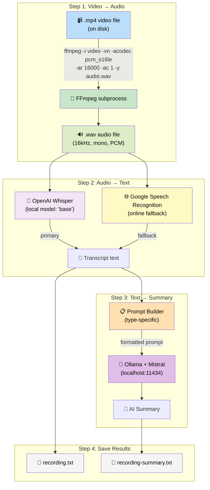

### 9.1 The Python Script (`audio_extractor.py`)

The Python script is spawned as a child process by `transcript.utils.ts`. It operates in a strict pipeline:

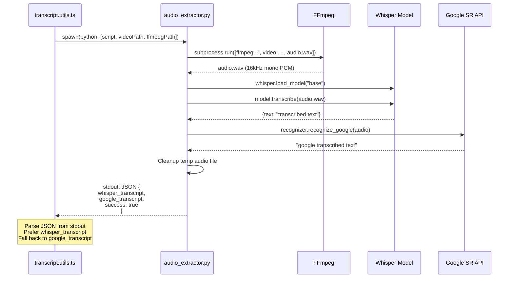

### 9.2 Recording Type-Specific Prompts

The `getPromptForType()` function tailors the AI summary based on the recording type:

| Recording Type | Prompt Focus Areas |
| --- | --- |
| **GOOGLE_MEET** | Summary of topics, key decisions, action items with assignees, important insights |
| **LESSON** | Learning objectives, key concepts, definitions, examples, homework/assignments |
| **VIDEO** | Content summary, key highlights, important info, actionable items |

### 9.3 Fallback Chain

The system is designed with multiple fallback levels:

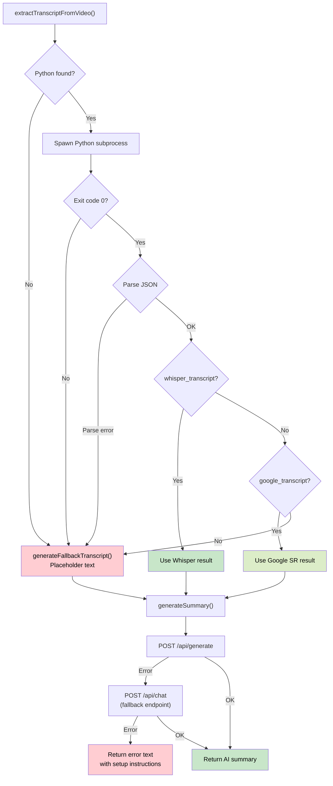

---

## 10. Binary Resolution Strategy

Finding Python and FFmpeg binaries is complex because they can be installed in many different ways on Windows. The `transcript.utils.ts` module implements a multi-strategy resolution approach.

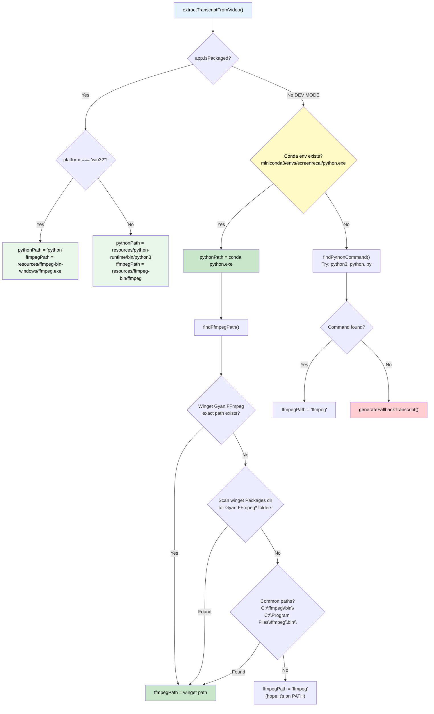

### Resolution Priority

**Python:**
1. Conda env (`miniconda3/envs/screenrecai/python.exe`) — highest priority in dev mode
2. System commands (`python3` → `python` → `py`) — tested with `--version`
3. Bundled runtime — used in packaged app

**FFmpeg:**
1. Winget Gyan.FFmpeg exact versioned path
2. Winget Gyan.FFmpeg directory scan (any version)
3. Common manual install paths (`C:\ffmpeg\bin\`, `C:\Program Files\ffmpeg\bin\`)
4. System PATH fallback

---

## 11. File Storage Organization

Recordings are stored under a **configurable storage directory** (defaults to `~/Desktop/captured-videos/`). Users can change the storage location via the **StoragePath** component, which persists the choice in `storage-config.json` inside the Electron `userData` directory.

```text
{storagePath}/
└── (defaults to ~/Desktop/captured-videos/)
    ├── 2025-01-15/
    │   ├── recording-2025-01-15-10-30-00.mp4       ← Video file
    │   ├── recording-2025-01-15-10-30-00.wav       ← Extracted audio
    │   ├── recording-2025-01-15-10-30-00.txt       ← Transcript text
    │   └── recording-2025-01-15-10-30-00-summary.txt ← AI summary
    ├── 2025-01-16/
    │   ├── recording-2025-01-16-14-20-30.mp4
    │   ├── recording-2025-01-16-14-20-30.wav
    │   ├── recording-2025-01-16-14-20-30.txt
    │   └── recording-2025-01-16-14-20-30-summary.txt
    └── ...
```

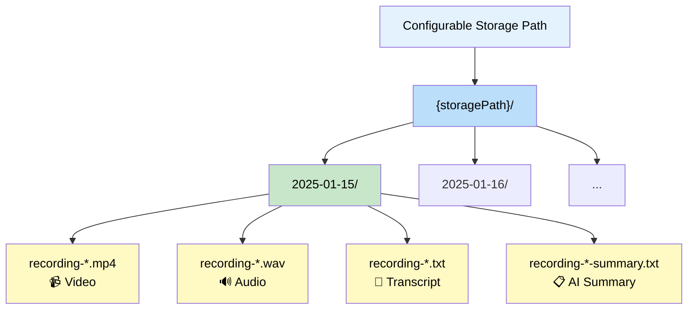

**Naming convention:**
- Save: `recording-YYYY-MM-DD-HH-MM-SS` (from `generateFilename()`)
- Transcript: `recording-YYYY-MM-DDTHH-MM-SS` (from `generateTranscriptFilename()`, ISO format)

---

## 12. Build & Packaging

### 12.1 Vite Configuration (`electron.vite.config.ts`)

The project uses `electron-vite` which provides a **three-target build** in a single config:

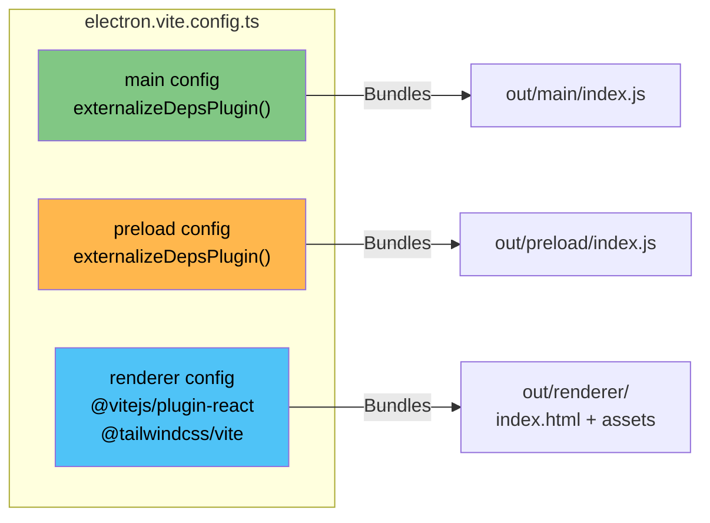

`externalizeDepsPlugin()` is used for main and preload to keep Node.js dependencies external (not bundled), since Electron already provides Node.js.

### 12.2 Electron Builder (`electron-builder.yml`)

Key packaging details:

```yaml
extraResources:
  - audio_extractor.py    # Python script for transcription
  - requirements.txt      # Python dependencies list
  - setup.py              # Python setup script
  - python-runtime        # Bundled Python (Linux/macOS)
  - ffmpeg-bin            # Bundled FFmpeg (Linux/macOS)

win:
  extraResources:
    - ffmpeg-bin-windows   # Windows-specific FFmpeg
  target:
    - nsis                 # NSIS installer
```

### 12.3 Dev vs Production Paths

| Resource | Dev Mode | Production |
| --- | --- | --- |
| Renderer URL | `http://localhost:5173` | `file://...out/renderer/index.html` |
| Python | Conda env or system | Bundled `python-runtime/` or system |
| FFmpeg | Winget install or PATH | Bundled `ffmpeg-bin/` |
| `audio_extractor.py` | Project root `./` | `process.resourcesPath/` |

---

## 13. Type System

The project uses a layered type system with shared interfaces across processes:

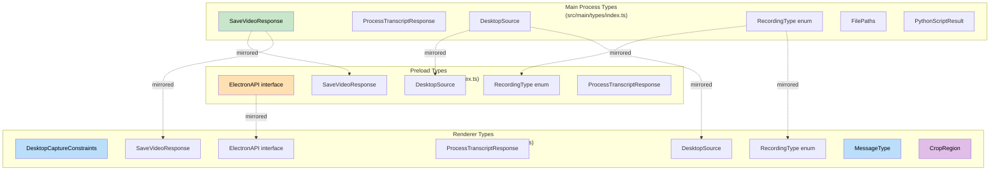

> **Note:** Types are duplicated across processes because each Electron process has its own TypeScript compilation target. The `RecordingType` enum, `SaveVideoResponse`, `ProcessTranscriptResponse`, and `DesktopSource` interfaces are defined in all three layers. The `CropRegion` interface is renderer-only.

### Key Interfaces

```typescript
// Core recording type selector
enum RecordingType {
  GOOGLE_MEET = 'google_meet',
  LESSON = 'lesson',
  VIDEO = 'video'
}

// Electron-specific media constraints
interface DesktopCaptureConstraints {
  mandatory: {
    chromeMediaSource: 'desktop'
    chromeMediaSourceId: string
  }
}

// Normalized crop region (0–1 relative to source video dimensions)
interface CropRegion {
  x: number      // left edge (0 = left, 1 = right)
  y: number      // top edge (0 = top, 1 = bottom)
  width: number   // fraction of video width
  height: number  // fraction of video height
}

// Python script JSON output format
interface PythonScriptResult {
  audio_path: string
  whisper_transcript?: string
  google_transcript?: string
  success: boolean
}

// Exposed API contract
interface ElectronAPI {
  getDesktopSources: () => Promise<DesktopSource[]>
  saveVideo: (blob: Blob, filename: string) => Promise<SaveVideoResponse>
  processTranscript: (blob: Blob, filename: string, type: RecordingType) => Promise<ProcessTranscriptResponse>
  getStoragePath: () => Promise<string>
  selectStoragePath: () => Promise<string | null>
}
```

---

## 14. Excalidraw Diagrams

Visual diagrams for complex sections are provided as Excalidraw files:

| Diagram | File | Description |
| --- | --- | --- |
| Architecture Overview | [architecture.excalidraw](architecture.excalidraw) | Visual layout of the three-process architecture with data flow arrows |
| AI Pipeline | [ai-pipeline.excalidraw](ai-pipeline.excalidraw) | Detailed view of Video → Audio → Transcript → Summary pipeline |
| Data Flow | [data-flow.excalidraw](data-flow.excalidraw) | End-to-end data flow from user click to saved files |

Open these files in VS Code with the Excalidraw extension, or at [excalidraw.com](https://excalidraw.com).

---

*Document generated for ScreenRecAI-Desktop. For setup instructions, see [README.md](../README.md).*
